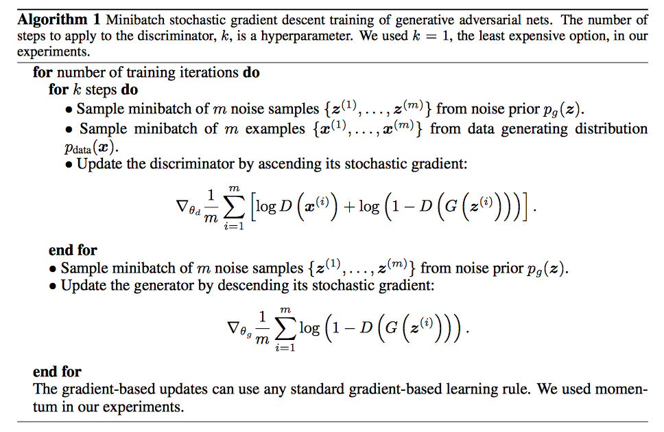

## Tensorflow-gan-mnist

Tensorflow implementation of Generative Adversarial Networks[1] for MNIST dataset

This tutorial help you walk through basic idea of GAN using MNIST data
## Dataset
You can download mnist data using tensorflow api.

```python
from tensorflow.examples.tutorials.mnist import input_data

mnist = input_data.read_data_sets("MNIST_data/")

train_images = mnist.train.images

test_images = mnist.test.images
```

## Description
A GAN network contains two nerual networks.

One is discrimator network, which will accept 28 * 28 dimensions images as input, and will ouput a
probabilty indicating that this input is a real data.

The other one is generator network, which will accept 100 dimension vector as input, which is sampled from normal distribution, and will output a 28 * 28 images as fake data.

## Cost function
The detail algorithm is as following:
 

## Result


## Reference

[1] Goodfellow, Ian, et al. "Generative adversarial nets." Advances in neural information processing systems. 2014.